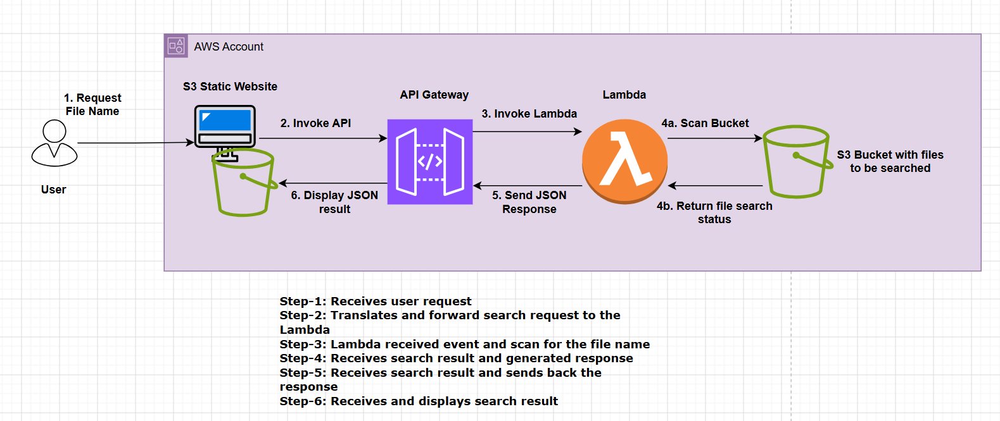

# Architecture Overview – S3 File Scan POC

## Objective
The objective of this Proof of Concept (POC) is to demonstrate a **simple, scalable, and fully serverless mechanism** to locate files stored in Amazon S3 based only on a user‑provided file name.

The solution intentionally hides storage details from the user and pushes all discovery and validation logic to the backend, resulting in a clean UI and a robust backend design.

---

## High‑Level Architecture



### Components Involved
- **Amazon S3 (Static Website Hosting)** – Hosts the frontend UI
- **Amazon API Gateway (REST API)** – Exposes a backend `/scan` endpoint
- **AWS Lambda** – Contains file‑search and validation logic
- **Amazon S3 (Data Storage)** – Stores files organized by type (CSV, JSON, XML, HTML)

---

## Architecture Flow (End‑to‑End)

1. **User Interaction**
   - The user opens the static web UI hosted in Amazon S3.
   - The user provides only a file name (for example: `employee_data.csv`).

2. **Frontend Request**
   - The UI sends a `POST` request to the API Gateway endpoint:
     ```
     POST /prod/scan
     ```
   - The request body contains only the file name:
     ```json
     {
       "file_name": "employee_data.csv"
     }
     ```

3. **API Gateway**
   - API Gateway acts as the entry point and forwards the request to AWS Lambda using a proxy integration.
   - CORS is enabled to allow browser‑based access.

4. **Lambda Processing**
   - AWS Lambda performs the following steps:
     - Parses input from API Gateway or direct test invocation.
     - Validates the file name and extension.
     - Determines which S3 prefixes to search based on file type.
     - Searches the S3 bucket for a matching file.
     - Constructs the full S3 URI if the file is found.

5. **Response Handling**
   - Lambda returns a structured JSON response back to API Gateway.
   - API Gateway forwards the response to the UI.

6. **Result Display**
   - The UI displays:
     - ✅ File found (success scenario)
     - ❌ File not found (negative scenario)
     - ⚠️ Invalid file name (validation scenario)

This approach allows:
- Simple and predictable searches
- Easy extension to new file types
- Straightforward IAM permission scoping

---

## Security Considerations

- **No AWS credentials** are exposed to the frontend.
- The UI communicates strictly through API Gateway.
- Lambda uses an IAM role with **least‑privilege access**:
  - `s3:ListBucket`
  - `s3:GetObject`
  - CloudWatch Logs permissions
- The frontend does not directly access S3 data objects.

> Note: For the POC, the S3 static website is publicly accessible.  
> For production, this can be hardened using **CloudFront + Origin Access Control (OAC)**.

---

## Why This Architecture?

### Serverless First
- No servers to manage
- Automatic scaling
- Pay‑per‑use cost model

### Separation of Concerns
- UI is purely static and lightweight
- Business logic and validation live in Lambda
- Storage details remain backend‑only

### Simplicity
- One API endpoint
- One Lambda function
- Clear responsibility boundaries

---

## Scalability & Extensibility

This architecture can be easily extended to support:
- Multiple file matches
- Partial or fuzzy file name search
- Metadata extraction
- File previews
- Authentication (Amazon Cognito)
- Private S3 access using CloudFront

---

## Summary

This architecture demonstrates how a common enterprise requirement—**searching objects in S3**—can be implemented using modern AWS serverless patterns.  
It balances simplicity, security, and scalability while remaining easy to understand, test, and extend.

The POC is intentionally designed to be:
- ✅ Easy to demo
- ✅ Easy to deploy via Terraform
- ✅ Easy to evolve into a production‑ready solution