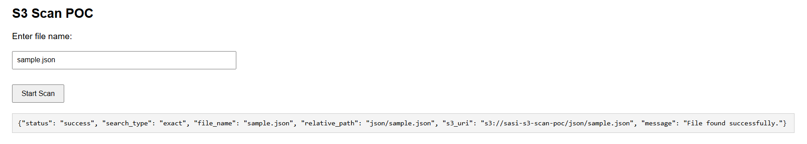
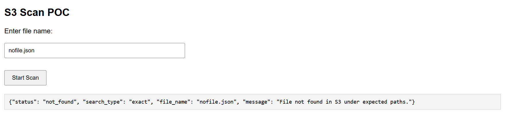
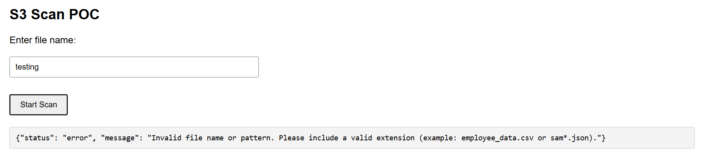
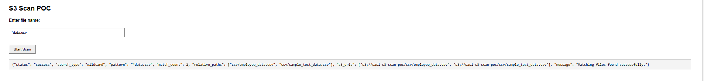
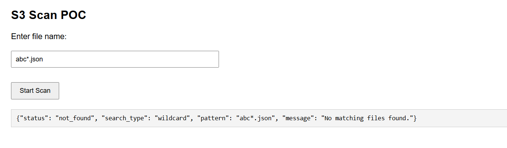
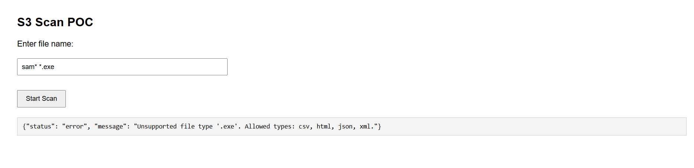

# S3 File Scan POC (Serverless)

## Overview
This project demonstrates a fully serverless AWS solution to dynamically locate files in Amazon S3 using a simple web-based UI.

Users provide only a file name (for example, `employee_data.csv`).  
The backend automatically determines where to search and returns the file location if it exists.

The solution is built entirely using managed AWS services.

---

## Architecture

**Components**
- **Amazon S3** – Hosts the static frontend UI and the sample data files
- **Amazon API Gateway (REST API)** – Exposes a backend endpoint for scanning requests
- **AWS Lambda** – Implements file discovery logic across S3 prefixes

Want to understand more about Architecture??
   👉 [Architecture](architecture.md)

---

## Features
- Serverless, no infrastructure management
- Clean separation of frontend and backend
- Input validation and user-friendly error handling
- Supports multiple file types: CSV, JSON, XML, HTML
- Works via UI, API Gateway, and direct Lambda invocation

---

## Live Demo Scenarios

### ✅ Success: File Found
User enters a valid file name that exists in S3.

---

### ❌ Negative: File Not Found
User enters a file name that does not exist.

---

### ⚠️ Invalid Input
User enters a file name without a valid extension or with an unsupported format.

---

### ✅ Wildcard Search – Multiple Matches Found

User searches using wildcard pattern to find multiple files.

---

### ❌ Wildcard Search – No Matches Found

User enters a wildcard pattern that does not match any files.

---

### ⚠️ Invalid Wildcard Pattern

User enters a wildcard pattern without valid extension or incorrect format.

---

## Deployment
All infrastructure is deployed using **Terraform**.

### Resources created:
- S3 bucket with static website hosting
- Pre-seeded folders and sample data
- REST API Gateway with `/scan` endpoint
- AWS Lambda with appropriate IAM role
- CORS-enabled API for browser access

Refer to the `terraform/` directory for complete Terraform code.

---

## Documentation
Detailed documentation is available in the `docs/` folder:
- Architecture details
- Demo walkthrough
- Design decisions and future scope

---

## Future Enhancements
• Add authentication via Amazon Cognito
• Advanced search (partial match, fuzzy search)  
• Metadata-based filtering (date, owner, type)  
• UI enhancements with search suggestions  
• File preview and download links  
• Performance optimization for large datasets  
• Integration with analytics pipelines 

Want to understand more about Future plans?? 
   👉 [Future Plans](decisions-and-future.md)

---

## Conclusion
This POC showcases a scalable, secure, and cost-efficient way to build search-based workflows on AWS using serverless services.